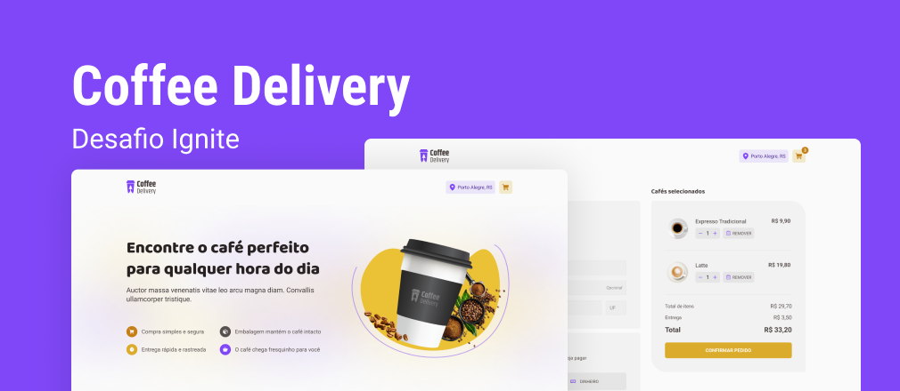

<h1 align="center">
  
</h1>

  <a href="#-tecnologias">Tecnologias</a>&nbsp;&nbsp;&nbsp;|&nbsp;&nbsp;&nbsp;
  <a href="#-projeto">Projeto</a>&nbsp;&nbsp;&nbsp;|&nbsp;&nbsp;&nbsp;
  <a href="#-layout">Layout</a>&nbsp;&nbsp;&nbsp;|&nbsp;&nbsp;&nbsp;
  <a href="#-como-executar">Como executar</a>&nbsp;&nbsp;&nbsp;|&nbsp;&nbsp;&nbsp;
  <a href="#-licença">Licença</a>

 

  

## ✨ Tecnologias

Esse projeto foi desenvolvido com as seguintes tecnologias:

- [React](https://reactjs.org)
- [Vite](https://vitejs.dev/)
- [React Hook Form](https://react-hook-form.com/)
- [React Router DOM](https://reactrouter.com/en/main/)
- [TypeScript](https://www.typescriptlang.org/)
- [Styled Components](https://styled-components.com/)
- [Radix UI](https://www.radix-ui.com/)

## 💻 Projeto

O Coffee Delivery é uma aplicação semelhante à um e-commerce para venda de cafés, incluindo funcionalidades como carrinho de compras, conexão com APIs internas e externas para identificação de endereço, dentre outras.

## 🔖 Layout

Você pode visualizar o layout do projeto através [desse link](https://www.figma.com/file/5yT9ZzZmRQRS4yivGGB3pl/Coffee-Delivery). É necessário ter conta no [Figma](http://figma.com/) para acessá-lo.

## 🚀 Como executar

- Clone o repositório
- Instale as dependências com `yarn`
- Inicie o servidor com `yarn server`
- Inicie a aplicação web com `yarn dev`

Agora você pode acessar [`localhost:5173`](http://localhost:5173) do seu navegador.

## 📄 Licença

Esse projeto está sob a licença MIT. Veja o arquivo [LICENSE](LICENSE.md) para mais detalhes.

---

Feito com ♥ por Erick Nathan durante o programa de formação [Ingite](https://lp.rocketseat.com.br/ignite) promovido pela [Rocketseat](https://www.rocketseat.com.br/)
